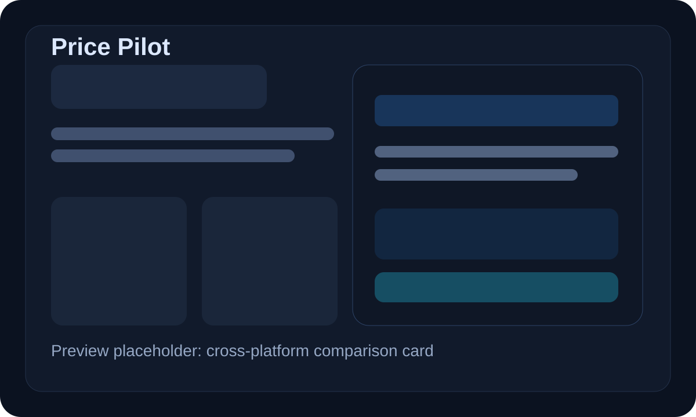

<h1 align="center">Price Pilot</h1>

<p align="center">
  <strong>给你的 AI Agent 一键装上国内电商比价能力</strong>
</p>

<p align="center">
  <a href="LICENSE"></a>
  <a href="https://www.python.org/"></a>
  <a href="https://github.com/wby1121/price-pilot/actions/workflows/validate-skill.yml"></a>
</p>

<p align="center">
  <a href="#快速上手">快速开始</a> · <a href="#支持的平台">支持平台</a> · <a href="#装好就能用">装好就能用</a> · <a href="#设计理念">设计理念</a>
</p>

<p align="center">
  
</p>

---

## 为什么需要 Price Pilot？

AI Agent 已经能帮你写代码、查文档、管项目，但一旦你让它去国内电商里认真比价，它往往还是会掉进三个坑：

- 只看一个平台，结论不完整
- 只比标价，不看评论、售后、成色和风险
- 只会堆链接，不会给出真正能下单的建议

你想问的通常不是“有没有这个商品”，而是：

- “iPhone 15 Pro 256G 现在哪买最值？”
- “Switch OLED 二手到底选闲鱼还是转转？”
- “京东贵一点，但售后强，值不值得多花这几百？”
- “拼多多这个价格离谱，是真的吗，还是高风险？”

**Price Pilot 把这件事变成一句话：**

```text
帮我安装 Price Pilot：https://raw.githubusercontent.com/wby1121/price-pilot/main/docs/install.md
```

复制给你的 Agent，几分钟后它就能按统一规则去查京东、淘宝、拼多多、闲鱼和转转，输出可比较的商品列表，并给出综合评价和性价比排序。

**已经装过了？更新也是一句话：**

```text
帮我更新 Price Pilot：https://raw.githubusercontent.com/wby1121/price-pilot/main/docs/update.md
```

### 在你用之前，你可能想知道

| | |
|---|---|
| 免费开源 | 仓库、skill、评分逻辑都在这里，随时可改 |
| 面向 Agent | 不是给人手搓比价页面，而是给 Agent 一个稳定工作流 |
| 综合评分 | 不只比价格，还看评论、信息完整度、售后和风险 |
| 兼容多 Agent | Codex、OpenClaw、Cursor、Claude Code 都能接 |
| 可继续扩展 | 平台、规则、排序逻辑都可以继续加 |

---

## 支持的平台

| 平台 | 适合什么场景 | 核心判断点 |
|------|-------------|-----------|
| 京东 | 新品、官方店、售后敏感商品 | 自营、旗舰店、保修、发票、近期评价 |
| 淘宝 | SKU 丰富、配件、替代卖家 | 店铺分、评价图、配置一致性、退换政策 |
| 拼多多 | 低价基准、补贴价 | 百亿补贴、到手价、差评结构、投诉倾向 |
| 闲鱼 | 二手个人卖家、本地交易 | 卖家历史、实拍、成色披露、验机意愿 |
| 转转 | 二手但想要更多保障 | 验机报告、成色分级、退货窗、维修披露 |

> Price Pilot 的目标不是“抓到最多链接”，而是让 Agent 能返回最值得买、最安全、最划算的候选。

---

## 快速上手

复制这句话给你的 AI Agent：

```text
帮我安装 Price Pilot：https://raw.githubusercontent.com/wby1121/price-pilot/main/docs/install.md
```

就这一步。Agent 会把仓库里的 `price_pilot/skill` 安装到它自己的 skills 目录里。

> 已安装过？更新也是一句话：
> ```text
> 帮我更新 Price Pilot：https://raw.githubusercontent.com/wby1121/price-pilot/main/docs/update.md
> ```

---

## 装好就能用

不需要记命令，直接让 Agent 帮你做：

- “帮我找 iPhone 15 Pro 256G 国行，京东、淘宝、拼多多都看一下，按性价比排一下。”
- “我想买二手 Switch OLED，优先闲鱼和转转，避开高风险卖家。”
- “帮我比较 RTX 5070 显卡，重点看评论里翻车点和售后。”
- “给我一个最稳妥、一个最便宜、一个综合最值的选择。”

Price Pilot 返回的不是单纯链接堆砌，而是：

- 跨平台候选
- 统一字段对比
- 排名理由
- 风险提示
- 最终购买建议

---

## 设计理念

**Price Pilot 是一个 Agent 脚手架，不是传统比价站。**

它做的事情是把“国内购物比价”拆成稳定的几个步骤：

1. 搜平台
2. 抽字段
3. 做证据判断
4. 统一评分
5. 输出购买建议

仓库结构参考了 Agent Reach 的组织方式，核心目录如下：

```text
.
├── price_pilot/
│   ├── channels/
│   ├── cli.py
│   ├── core.py
│   ├── doctor.py
│   ├── ranking.py
│   └── skill/
├── docs/
├── tests/
└── .github/
```

### 每个平台都是可插拔的

```text
price_pilot/channels/
├── jd.py
├── taobao.py
├── pinduoduo.py
├── xianyu.py
├── zhuanzhuan.py
└── base.py
```

每个平台模块只负责描述平台定位和 doctor 可见的可用性。真正执行搜索与阅读时，Agent 仍然应该使用实时网页数据和 skill 内的工作流。

---

## 开发

```bash
python3 -m pip install .[dev]
python3 -m pytest
python3 -m price_pilot.cli doctor
python3 -m price_pilot.cli skill-path
python3 -m price_pilot.cli score --input sample.json
```

---

## 开源协作

仓库已经配置：

- PR 模板和 Issue 模板
- `CODEOWNERS`
- 自动请求 `@wby1121` 审核的 workflow
- CI 测试工作流

仓库变量 `REVIEW_OWNER` 已设置为 `wby1121`。外部贡献者打开或转为 Ready for review 的 PR 时，GitHub 会自动向你发起 review request。

## License

[MIT](LICENSE)
