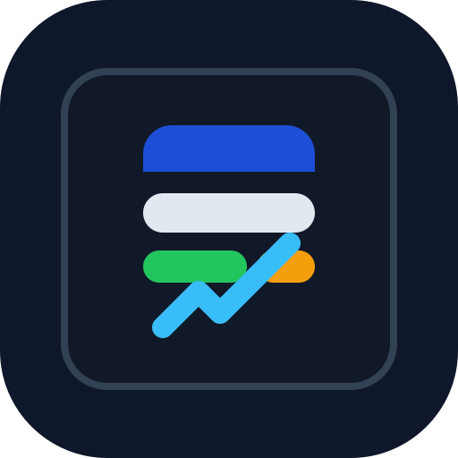

<h1 align="center">Price Pilot</h1>

<p align="center">
  
</p>

<p align="center">
  <strong>给你的 AI Agent 一键装上国内电商比价能力</strong>
</p>

<p align="center">
  <a href="LICENSE"></a>
  <a href="https://www.python.org/"></a>
  <a href="https://github.com/wby1121/price-pilot/actions/workflows/validate-skill.yml"></a>
</p>

<p align="center">
  <a href="#快速上手">快速开始</a> · <a href="docs/README_en.md">English</a> · <a href="#支持的平台">支持平台</a> · <a href="#选型介绍">选型介绍</a> · <a href="#安全性">安全性</a>
</p>

<p align="center">
  
</p>

---

## 为什么需要 Price Pilot？

AI Agent 已经能帮你写代码、查文档、管项目，但一旦你让它去国内电商里认真比价，它往往还是会掉进三个坑：

- 只看一个平台，结论不完整
- 只比标价，不看评论、售后、成色和风险
- 只会堆链接，不会给出真正能下单的建议

你想问的通常不是“有没有这个商品”，而是：

- “iPhone 15 Pro 256G 现在哪买最值？”
- “Switch OLED 二手到底选闲鱼还是转转？”
- “京东贵一点，但售后强，值不值得多花这几百？”
- “拼多多这个价格离谱，是真的吗，还是高风险？”

**Price Pilot 把这件事变成一句话：**

```text
帮我安装 Price Pilot：https://raw.githubusercontent.com/wby1121/price-pilot/main/docs/install.md
```

复制给你的 Agent，几分钟后它就能按统一规则去查京东、淘宝、拼多多、闲鱼和转转，输出可比较的商品列表，并给出综合评价和性价比排序。

**已经装过了？更新也是一句话：**

```text
帮我更新 Price Pilot：https://raw.githubusercontent.com/wby1121/price-pilot/main/docs/update.md
```

### 在你用之前，你可能想知道

| | |
|---|---|
| 免费开源 | 仓库、skill、评分逻辑都在这里，随时可改 |
| 面向 Agent | 不是给人手搓比价页面，而是给 Agent 一个稳定工作流 |
| 综合评分 | 不只比价格，还看评论、信息完整度、售后和风险 |
| 兼容多 Agent | Codex、OpenClaw、Cursor、Claude Code 都能接 |
| 可继续扩展 | 平台、规则、排序逻辑都可以继续加 |

---

## 支持的平台

| 平台 | 适合什么场景 | 核心判断点 |
|------|-------------|-----------|
| 京东 | 新品、官方店、售后敏感商品 | 自营、旗舰店、保修、发票、近期评价 |
| 淘宝 | SKU 丰富、配件、替代卖家 | 店铺分、评价图、配置一致性、退换政策 |
| 拼多多 | 低价基准、补贴价 | 百亿补贴、到手价、差评结构、投诉倾向 |
| 闲鱼 | 二手个人卖家、本地交易 | 卖家历史、实拍、成色披露、验机意愿 |
| 转转 | 二手但想要更多保障 | 验机报告、成色分级、退货窗、维修披露 |

> Price Pilot 的目标不是“抓到最多链接”，而是让 Agent 能返回最值得买、最安全、最划算的候选。

---

## 快速上手

复制这句话给你的 AI Agent：

```text
帮我安装 Price Pilot：https://raw.githubusercontent.com/wby1121/price-pilot/main/docs/install.md
```

如果你想自己手动装，也可以直接执行：

```bash
python3 -m pip install --upgrade "git+https://github.com/wby1121/price-pilot.git"
price-pilot install
```

就这一步。Agent 会把仓库里的 bundled skill 安装到它自己的 skills 目录里。

> OpenClaw 提示：
> 为了尽量避免 exec approval 弹窗，安装文档已经明确约束为 `pip install` + `price-pilot install`，不走 `git clone`。

> 已安装过？更新也是一句话：
> ```text
> 帮我更新 Price Pilot：https://raw.githubusercontent.com/wby1121/price-pilot/main/docs/update.md
> ```

> 不想用了？卸载也是一句话：
> ```text
> 帮我卸载 Price Pilot：https://raw.githubusercontent.com/wby1121/price-pilot/main/docs/uninstall.md
> ```

---

## 装好就能用

不需要记命令，直接让 Agent 帮你做：

- “帮我找 iPhone 15 Pro 256G 国行，京东、淘宝、拼多多都看一下，按性价比排一下。”
- “我想买二手 Switch OLED，优先闲鱼和转转，避开高风险卖家。”
- “帮我比较 RTX 5070 显卡，重点看评论里翻车点和售后。”
- “给我一个最稳妥、一个最便宜、一个综合最值的选择。”

Price Pilot 返回的不是单纯链接堆砌，而是：

- 跨平台候选
- 统一字段对比
- 排名理由
- 风险提示
- 最终购买建议

如果你要在本地直接验证四模块链路，也可以运行：

```bash
price-pilot workflow --input sample.json --inquiry-limit 3
```

输入可以是候选商品数组，或带 `candidates` / `replies` 的 JSON 对象。输出会一次性包含：

- 商品发现后的候选列表
- 候选评分结果
- 待人工确认的询价草稿
- 已解析的询价回复
- 最终推荐结果和原因

---

## 案例介绍

### 案例 1：买新机，不只是看最低价

用户问：

> “帮我找 iPhone 15 Pro 256G 国行，预算 7500，按性价比排一下。”

Price Pilot 应该输出：

- 京东官方店作为最稳妥选项
- 拼多多补贴价作为预算优先选项
- 淘宝替代店作为价格和售后的中间选项
- 每个平台为什么赢、为什么输

### 案例 2：买二手，风险比价格更重要

用户问：

> “我想买二手 Switch OLED，优先闲鱼和转转，避开高风险卖家。”

Price Pilot 应该重点检查：

- 卖家历史
- 实拍与成色描述
- 是否支持验机
- 是否有明显压价陷阱或引导脱离平台

### 案例 3：评论比参数更能决定是否值得买

用户问：

> “帮我比较 RTX 5070 显卡，重点看评论里的翻车点和售后。”

Price Pilot 应该把“散热差评、啸叫、返修、售后响应慢”等评论信号提升到排序依据里，而不是只比较参数表。

---

## 选型介绍

Price Pilot 当前不是自己维护一套爬虫平台，而是刻意采用更轻的 Agent 工作流方案：

| 场景 | 当前选型 | 为什么这样做 |
|------|----------|-------------|
| 实时搜索 | Agent + live web browsing | 商品价格、活动、评论会变，必须用实时数据 |
| 平台适配 | `price_pilot/channels/*.py` | 每个平台保持独立，方便以后换实现 |
| 排序逻辑 | `price_pilot/ranking.py` | 用统一评分把多平台结果拉到同一坐标系 |
| Agent 能力注入 | `price_pilot/skill/` | 让模型知道怎么搜、怎么比、怎么排 |
| 安装方式 | `price-pilot install` | 直接把 skill 安装到用户自己的 skills 目录 |
| 访问接入层 | `config.yaml` + `mcporter.json` | 用 cookie 与 MCP 别名承接真实访问能力 |

### 为什么不直接做成网页比价站

因为这个项目的核心不是“给人浏览”，而是“给 Agent 一套可靠的购物决策工作流”。Agent 读懂 skill 后，可以按用户偏好动态调整预算、风险偏好、平台范围和排序标准，这比固定页面更适合你这个项目的目标。

### Cookie / MCP 接入层

Price Pilot 现在开始提供一层和 Agent Reach 类似的接入骨架：

- 本地配置文件：`~/.price-pilot/config.yaml`
- cookie 工作流：
  `price-pilot config cookie import <platform> --file /path/to/cookies.json`
  `price-pilot config cookie validate <platform> --file /path/to/cookies.json`
  `price-pilot config cookie probe <platform>`
  `price-pilot config cookie status`
- `mcporter` 自动探测：优先读取 `~/.openclaw/workspace/config/mcporter.json`
- doctor 会检查每个平台是否有 cookie 或 MCP server

推荐阅读：

- [setup-cookies.md](price_pilot/guides/setup-cookies.md)
- [setup-mcporter.md](price_pilot/guides/setup-mcporter.md)

### 四模块架构

为了避免“某一层被反爬卡住，整个系统就完全失效”，Price Pilot 现在把能力拆成 4 个可独立演进的模块：

| 模块 | 负责什么 | 即使遇到反爬也能保留什么能力 |
|------|----------|------------------------------|
| 商品发现 | 搜索平台商品，提取标题、价格、成色、地区、卖家信誉、发布时间 | 仍然可以接收用户手动提供的链接、截图或搜索结果，继续进入后续评分 |
| 候选评分 | 计算性价比评分、风险评分，并生成推荐理由 | 即使无法自动问价，推荐系统仍然能工作 |
| 询价助手 | 生成询价话术，人工确认后发送，并跟踪回复 | 这是最容易受登录态和反爬影响的一层，但不会拖垮整体系统 |
| 汇总决策 | 汇总报价、候选评分与询价回复，输出推荐商品和原因 | 即使只有部分报价，也能给出当前最优建议和下一步动作 |

代码上也已经对应成独立模块：

- `price_pilot/discovery.py`
- `price_pilot/scoring.py`
- `price_pilot/inquiry.py`
- `price_pilot/decision.py`

这样后面无论我们接 cookie、MCP、浏览器自动化，还是人工半自动模式，都只需要替换“商品发现”或“询价助手”这一层，不需要推翻整个推荐系统。

---

## 安全性

Price Pilot 尽量保持最小侵入：

| 措施 | 说明 |
|------|------|
| 本地安装 | 默认只把 skill 复制到本地 skills 目录 |
| 无账号托管 | 不会要求你把平台 Cookie 存到这个仓库里 |
| 开源可审查 | 评分规则、安装逻辑、skill 提示词都在仓库中 |
| 可完全卸载 | 直接删除 skill，并可卸载 `price-pilot` 命令本身 |

### 需要特别注意的事

- Price Pilot 本身不绕过平台登录限制，也不替你保管平台账号。
- 如果后续你要接入 Cookie、MCP 或自动化登录能力，建议优先使用小号，不要直接用主账号。
- 对于闲鱼、转转这类二手平台，低价从来不等于低风险，评分结果应该始终配合人工复核。

---

## 安装方式

| 方式 | 命令 | 适合场景 |
|------|------|---------|
| Agent 一句话安装 | `帮我安装 Price Pilot: docs/install.md` | 日常使用 |
| 直接命令安装 | `python3 -m pip install "git+https://github.com/wby1121/price-pilot.git"` + `price-pilot install` | 自己手动安装 |
| 指定目录安装 | `price-pilot install --dir /path/to/skills` | 多套 skills 环境 |
| 更新 | `price-pilot update` | 保持最新版 skill |
| 卸载 | `price-pilot uninstall` | 删除已安装 skill |

---

## 卸载

删除 skill：

```bash
price-pilot uninstall
```

如果还想移除命令行工具本身：

```bash
python3 -m pip uninstall price-pilot
```

---

## 设计理念

**Price Pilot 是一个 Agent 脚手架，不是传统比价站。**

它做的事情是把“国内购物比价”拆成稳定的几个步骤：

1. 搜平台
2. 抽字段
3. 做证据判断
4. 统一评分
5. 输出购买建议

仓库结构参考了 Agent Reach 的组织方式，核心目录如下：

```text
.
├── price_pilot/
│   ├── channels/
│   ├── cli.py
│   ├── core.py
│   ├── doctor.py
│   ├── ranking.py
│   └── skill/
├── docs/
├── tests/
└── .github/
```

### 每个平台都是可插拔的

```text
price_pilot/channels/
├── jd.py
├── taobao.py
├── pinduoduo.py
├── xianyu.py
├── zhuanzhuan.py
└── base.py
```

每个平台模块只负责描述平台定位和 doctor 可见的可用性。真正执行搜索与阅读时，Agent 仍然应该使用实时网页数据和 skill 内的工作流。

## License

[MIT](LICENSE)
